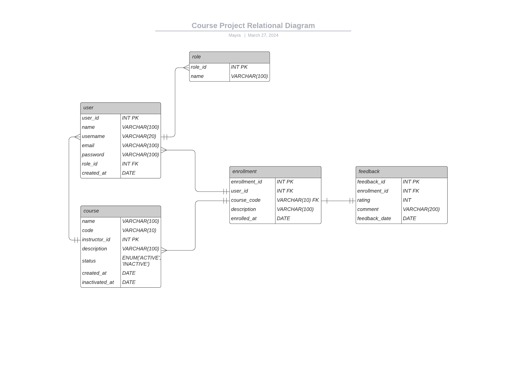
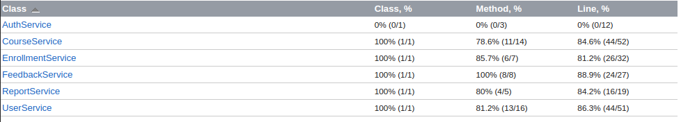

# Course Project
<p align="center">


  
  
 

</p>

<p align="center">
  
</p>  
  
# Summary
- [Project Specification](https://github.com/mayraamaral/course-project?tab=readme-ov-file#project-specification);
- [Development Tools](https://github.com/mayraamaral/course-project?tab=readme-ov-file#development-tools);
- [Deploy - AWS](https://github.com/mayraamaral/course-project?tab=readme-ov-file#deploy---aws);
- [Deploy - Backup](https://github.com/mayraamaral/course-project?tab=readme-ov-file#deploy---backup);
- [Running Locally - Instructions](https://github.com/mayraamaral/course-project?tab=readme-ov-file#running-locally---instructions):
  - [Running option #1 - Locally with Docker Compose](https://github.com/mayraamaral/course-project?tab=readme-ov-file#running-option-1---locally-with-docker-compose);
  - [Running option #2 - Locally with Docker](https://github.com/mayraamaral/course-project?tab=readme-ov-file#running-option-2---locally-with-docker):
    - [Database creation on Docker](https://github.com/mayraamaral/course-project?tab=readme-ov-file#database-creation-on-docker);
    - [Project build](https://github.com/mayraamaral/course-project?tab=readme-ov-file#project-build);
    - [Running](https://github.com/mayraamaral/course-project?tab=readme-ov-file#project-build);
- [DB Diagram](https://github.com/mayraamaral/course-project?tab=readme-ov-file#db-diagram);
- [Unit tests](https://github.com/mayraamaral/course-project?tab=readme-ov-file#unit-tests);
- [Observation](https://github.com/mayraamaral/course-project?tab=readme-ov-file#observation).
  
## Project Specification
- **Language:** Java 21;
- **Framework:** Spring v. 3.1.9;
- Spring Data JPA;
- Spring Security;
- Lombok;
- **RDBMS/Database:** MySQL;
- **Migrations:** Flyway;
- **Docs:** Open API Swagger;
- **Email**: JavaMail API & Mailgun;
- **Report Generator:** OpenPDF;
- **Unit Tests:** JUnit & Mockito.
## Development Tools
- **IDE:** IntelliJ;
- **Database client:** DBeaver;
- **Diagram tool:** Lucidchart;
- **Requests:** Swagger UI / HTTPie.
## Deploy - AWS
- **Database:** Using AWS RDS;
- **Spring App:** Using AWS ECS (Fargate) + ELB;
- [Link Deploy](http://course-project-425390798.us-east-1.elb.amazonaws.com/swagger-ui/index.html)
## Deploy - Backup
- Using Railway (both with MySQL and Spring App);
- [Deploy Link](https://course-project-production.up.railway.app/).
## Running Locally - Instructions
You can choose either to run with Docker Compose or to run two containers separated, both options
are described below:  
### Running option #1 - Locally with Docker Compose
Just fill the fields with the correct information and run the command in the terminal 
inside the project root folder and you will have both containers running.
```shell
MYSQL_PASSWORD=mysql JAVA_TOOL_OPTIONS="-Dspring.datasource.url=\"jdbc:mysql://db:3306/db\" AND OTHERS VM OPTIONS" docker-compose up
```
### Running option #2 - Locally with Docker
#### Database creation on Docker
```shell
docker run -d -p 3306:3306 --name mysql \
-e MYSQL_ROOT_PASSWORD=mysql -e MYSQL_USER=app -e MYSQL_DATABASE=db \
-e MYSQL_PASSWORD=mysql mysql/mysql-server:latest
```
#### Project build
```shell
docker build -t courses .
```
#### Running
```shell
docker run -p 8080:8080 -e JAVA_TOOL_OPTIONS="VM_OPTIONS" --name courses courses
```
### DB Diagram
<p align="center">
  
</p>  
  
### Unit tests
Main service classes with > 80% of LOC (lines of code) coverage. 85% of the app service classes are covered
by unit tests. Total of 35 unit tests.  
[Link to access full coverage report](https://course-project-report.vercel.app/ns-1/index.html)  
<p align="center">
  
</p>  

### Observation
For security concerns URLs, users and passwords do not have the current values in the ```application.properties``` file, instead they are passed via VM Options.